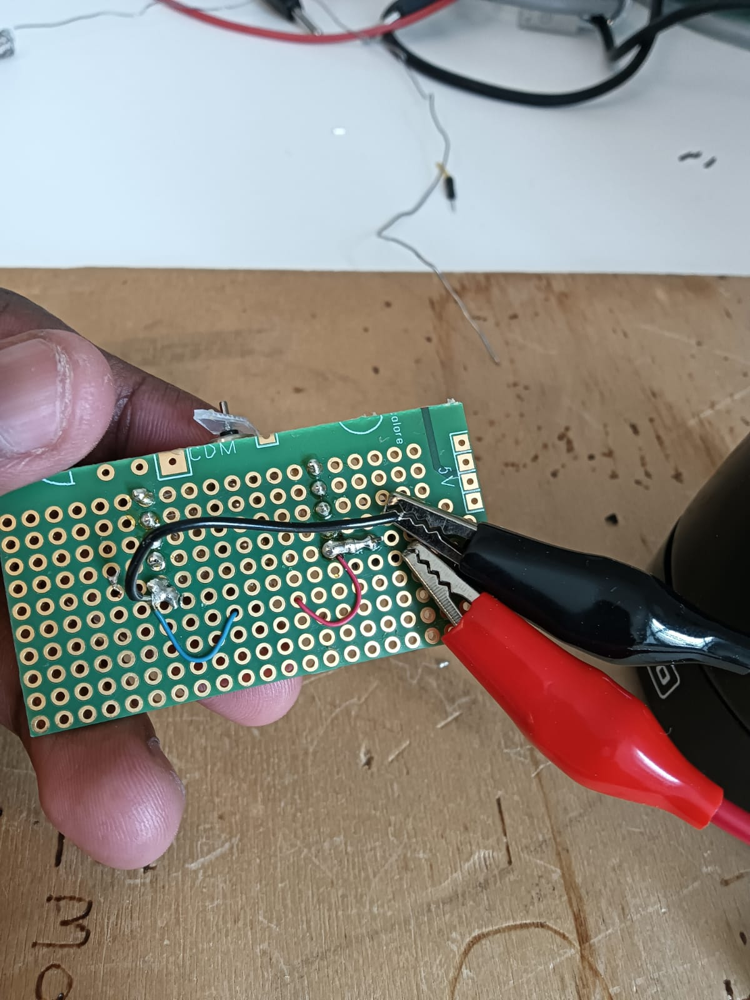
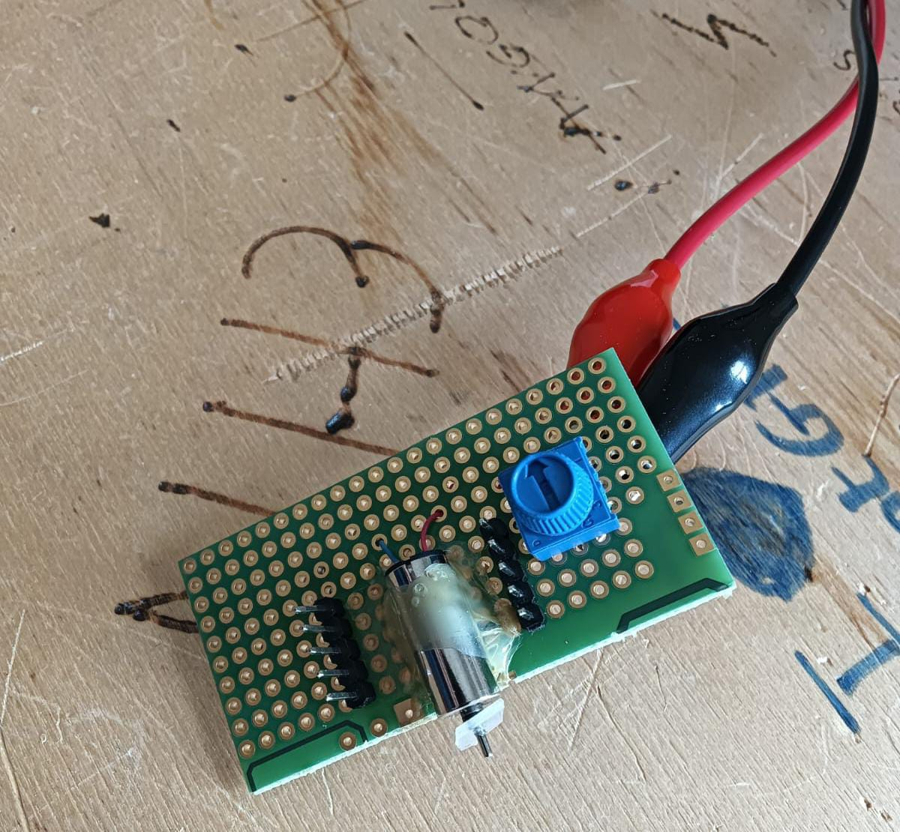

# Mosquitoes-sensor

Prototype for mosquito detection using motor-simulated wing vibration, IR/ultrasonic sensors, and signal processing with MATLAB/Embedded C.

---

## Project Overview
Mosquitoes spread diseases like dengue, malaria, and chikungunya. This project explores low-cost methods for **detecting mosquito presence and species identification** by analyzing wing vibrations.

Two main approaches are studied:
- **Light interaction**: Using IR/photoelectric sensors to capture wingbeat frequencies.
- **Sound interaction**: Simulating mosquito wing sounds and analyzing them with signal processing.

---

## Hardware Components
- DC motor with custom wing attachment (to simulate mosquito wing flapping)
- Potentiometer (motor speed control)
- IR emitter and photodiode / photoelectric sensor
- Optional: Ultrasonic transducter
- Breadboard / PCB prototype
- Power supply (low voltage, low consumption)

---
## 📸 Prototype Images

(Back view):  

Frontside wiring with motor and potentiometer:  

## Software & Tools
- **Embedded C** for microcontroller firmware
- **MATLAB/Simulink** for signal processing & visualization
- **TINA-TI** for analog circuit simulation
- Oscilloscope for real-time signal validation

---

## Objectives
1. Control and vary motor speed to simulate mosquito wing frequencies (< 1000 Hz).
2. Capture reflected light/signal from wings and body using different wavelengths.
3. Analyze signals for species-specific characteristics.
4. Explore ultrasonic simulation inspired by bat echolocation.
5. Develop a low-cost, low-power prototype.

---

