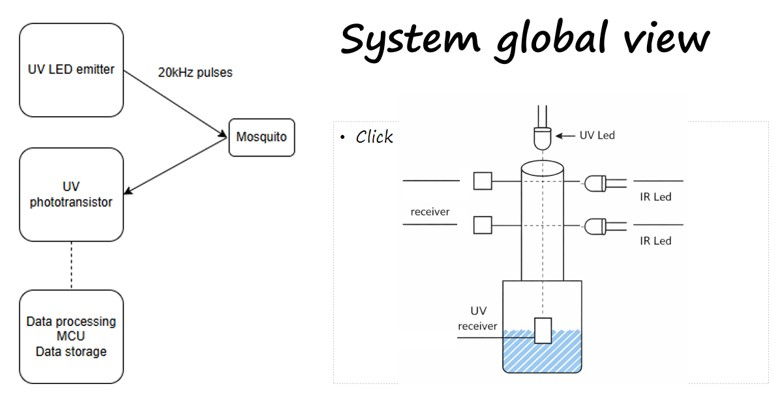
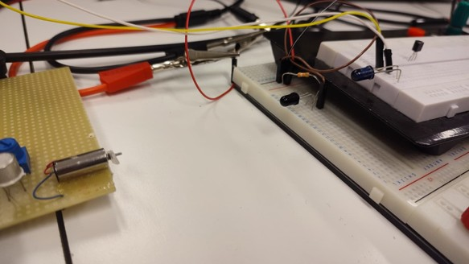
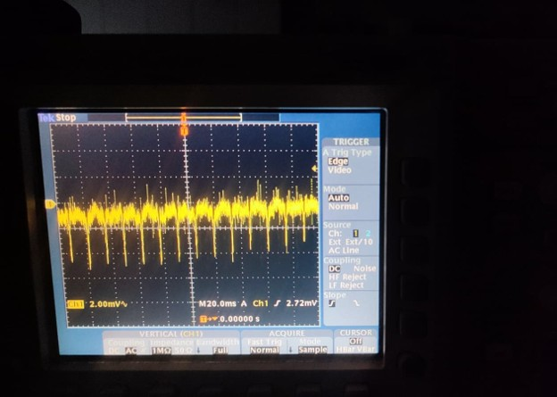
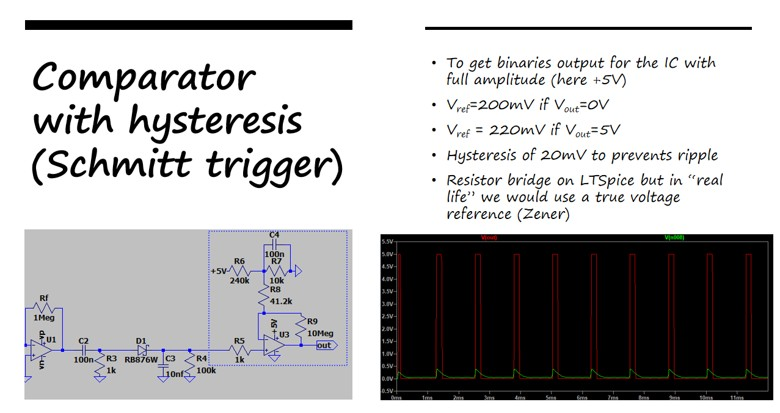

# Optical Mosquito Wingbeat Detection and Signal Processing System

Prototype for mosquito wingbeat detection using pulsed UV optical sensing, analog signal processing, LTspice simulation, and experimental validation.

---

## Project Overview

Mosquitoes are vectors for diseases such as malaria, dengue fever, chikungunya, and Zika virus. Monitoring mosquito populations and studying their behavior can support disease surveillance, ecological studies, and vector control strategies.

This project investigates a low-cost optical sensing method for detecting mosquito wingbeat activity. A pulsed UV LED transmitter and a phototransistor receiver are used to generate and detect optical signals. When a mosquito crosses the sensing area, its wing motion modulates the received light, producing characteristic frequency signatures that can be detected and analyzed.

The project combines optical sensing, analog electronics, circuit simulation, signal processing, and laboratory validation to demonstrate the feasibility of wingbeat-based mosquito detection.

---

This work focuses on the sensing and analog signal-conditioning stages of a mosquito detection system and serves as a proof of concept for future embedded implementation.

## Technical Areas

* Analog Electronics
* Optical Sensing
* Signal Processing
* LTspice Simulation
* Hardware Prototyping
* Oscilloscope Validation
* Sensor Interfacing

---

## Use Cases

* Mosquito population monitoring
* Species behavior studies
* Insect activity detection
* Environmental monitoring
* Research support for vector-borne disease prevention
* Low-cost autonomous sensing platforms

---

## System Requirements

The proposed system is intended to:

* Operate as a low-power autonomous trap
* Attract mosquitoes into the sensing area
* Detect the presence of a mosquito
* Measure wingbeat frequencies
* Process detection events
* Allow data retrieval for scientific analysis

---

# System Architecture

## Main Components

* UV LED transmitter
* Phototransistor receiver
* NE555 pulse generator
* Signal conditioning circuitry
* Low-pass filter
* Inverting amplifier
* High-pass filter
* Peak-hold circuit
* Schmitt trigger comparator

---

## Detection Principle

1. The UV LED generates high-frequency optical pulses (20 kHz).
2. A mosquito crossing the optical path modulates the received light signal.
3. The phototransistor converts optical variations into electrical signals.
4. Analog signal-processing stages remove noise and amplify the useful signal.
5. A Schmitt trigger comparator converts the conditioned analog signal into clean digital pulses.
6. The resulting pulses can be processed by a future embedded system for wingbeat frequency measurement and event logging.

---

# First Proof of Concept

A DC motor with a reflective element was used to simulate mosquito wing motion.

## Objective

Validate the optical sensing concept before building a complete mosquito detection prototype.

## Observations

* Optical interruptions were successfully detected.
* The UV beam was too narrow to produce significant signal variation.
* Additional improvements were required to obtain stronger detection signals.

---

# Second Proof of Concept

A reflective interruption approach was implemented to better represent the interaction between mosquito wings and the optical sensing path.

## Improvements

* Better optical interruption of the light beam
* More realistic representation of wing movement
* Improved signal visibility

## Results

The optical signal showed clear variations corresponding to the simulated wing motion.

---

# Experimental Validation

Oscilloscope measurements confirmed that:

* Detection spikes were clearly distinguishable from background noise.
* The optical sensing principle was functional.
* Wingbeat-related disturbances could be detected.
* Additional amplification stages were required to improve signal amplitude.

---

# Circuit Design

## UV LED Pulse Generator

A pulsed UV LED approach was selected instead of continuous illumination.

### Advantages

* Higher peak optical power
* Improved signal-to-noise ratio
* Reduced average power consumption
* Increased sensing distance

The pulse generator was implemented using a NE555 timer and a MOSFET switching stage.

---

## NE555 Timer Circuit

The NE555 timer was configured as an astable oscillator.

### Functions

* Generates periodic pulses
* Drives the UV LED switching circuit
* Provides stable timing performance

### Design Parameters

* Supply Voltage: 5 V
* Operating Frequency: 20 kHz
* Duty Cycle: Approximately 20%

---

## Capacitor Charge and Discharge Analysis

LTspice simulations were used to validate timer operation.

### Key Observations

* Capacitor voltage oscillates between threshold levels.
* Stable pulse generation was achieved.
* The diode network allows duty-cycle optimization.

---

## LED Current Analysis

Simulation results showed:

* Average LED current ≈ 19 mA
* RMS LED current ≈ 40 mA

These values remain within a safe operating range for the selected UV LED.

---

# Signal Processing Design

The phototransistor output contains both the desired wingbeat information and high-frequency optical pulse components.

Several analog stages were designed to isolate and enhance the useful signal.

---

## Low-Pass Filter

### Purpose

Remove the 20 kHz optical carrier generated by the UV LED pulses.

### Design Parameters

* Cutoff Frequency: 1 kHz

### Result

The filter preserves mosquito wingbeat frequencies while attenuating high-frequency optical noise.

---

## Inverting Amplifier

### Purpose

Amplify the weak phototransistor signal.

### Features

* High voltage gain
* Signal inversion
* Improved visibility of wingbeat events

### Observation

High amplification factors should be implemented using multiple stages to ensure stability.

---

## High-Pass Filter

### Purpose

Remove DC offset and slow variations.

### Design Parameters

* Cutoff Frequency: 160 Hz

### Result

The wingbeat signal becomes more distinct and easier to process.

---

## Peak-Hold Circuit

### Purpose

Extend the duration of short detection pulses.

### Features

* Schottky diode peak detector
* Capacitor-based charge storage
* Controlled discharge through resistor network

### Benefits

* Easier event detection
* Reduced sensitivity to pulse duration

---

## Schmitt Trigger Comparator

### Purpose

Convert the analog signal into a clean digital output.

### Features

* Hysteresis implementation
* Noise immunity
* Full-scale digital transitions

### Benefits

* Reliable pulse generation
* Improved robustness
* Easier frequency measurement

---

# Simulation Results

LTspice simulations validated:

* UV pulse generation
* LED current limits
* Filter performance
* Amplifier operation
* Peak detection behavior
* Comparator switching thresholds

The complete signal chain successfully converted weak optical disturbances into clean digital pulses suitable for future embedded processing.

---

# Experimental Results

The prototype demonstrated:

* Successful optical detection of simulated mosquito wingbeats
* Clear signal extraction from background noise
* Effective analog conditioning
* Reliable pulse generation

The proof of concept confirms the feasibility of low-cost mosquito detection using optical sensing and analog signal processing techniques.

---

# Skills Demonstrated

* Analog Electronics Design
* Optical Sensing Systems
* Signal Processing
* LTspice Circuit Simulation
* Oscilloscope Measurements
* Electronic System Validation
* Hardware Prototyping
* Experimental Testing
* Sensor Interfacing
* Circuit Design and Analysis
* Electronic System Design

---

# Tools Used

* LTspice
* Oscilloscope
* UV LEDs
* Phototransistors
* NE555 Timer
* MOSFET Driver Circuit
* Breadboard Prototypes
* MATLAB (Signal Analysis)

---

# Future Improvements

* Real mosquito testing
* Microcontroller-based frequency measurement and event logging
* Improved optical geometry and sensing range
* Wireless data transmission
* Battery-powered autonomous operation
* Cloud-based monitoring platform
* Potential future extension: automated insect classification using wingbeat signatures

---

# Repository Contents

* Project report
* Presentation slides
* LTspice simulation results
* Experimental validation images
* Oscilloscope captures

---

## Author

**SAKTHIVEL Balakumar**
Final-year Master's Student (Bac+5) in Embedded Systems
ISEP Paris, France

**GitHub:** https://github.com/Bala200166

**LinkedIn:** https://www.linkedin.com/in/balakumar-sakthivel-4aba55210
